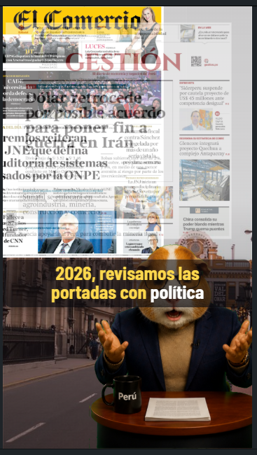

# News Video MVP

Pipeline editorial para convertir portadas de periodicos en videos verticales tipo TikTok con narrativa asistida, voz sintetica, subtitulos y composicion visual en Remotion.

Este proyecto combina:

- ingestion y scraping de portadas,
- seleccion editorial asistida con prompts,
- generacion de speech y voz,
- composicion visual automatizada,
- operacion diaria desde Streamlit.

Cuenta donde se publican los videos:

- [@renacimiento.academy en TikTok](https://www.tiktok.com/@renacimiento.academy)

## Demo visual

### Remotion Studio


### Portada + anchor + narrativa


### Soporte visual para contexto numerico



### Variante editorial / coyuntura internacional


## Que resuelve

El repo esta pensado para una operacion semi automatizada de noticias cortas:

1. descargar portadas por diario,
2. detectar historias principales,
3. preparar contexto editorial,
4. generar speeches breves para video,
5. sintetizar voz,
6. construir un preview diario en Remotion,
7. operar y revisar todo desde Streamlit.

## Resultado

El formato final apunta a video vertical `1080x1920` con:

- portada visible como asset principal,
- narrador o personaje editor,
- subtitulos sincronizados,
- zoom editorial sobre regiones de portada,
- soporte visual opcional para cifras, rankings o marcadores,
- ritmo breve pensado para redes.

## Arquitectura

```text
Portadas / Fuentes
        ↓
  Automation Pipeline
        ↓
 Seleccion editorial
        ↓
 Speech + Voice
        ↓
 Story Manifest
        ↓
 Remotion Preview / Render
        ↓
   Salida vertical lista
```

## Stack

- `Python` para pipeline, manifests, TTS y automatizacion
- `Streamlit` para operacion diaria y revision editorial
- `Remotion` para composicion visual y preview
- `Voicebox / TTS` para narracion
- `JSON manifests` para orquestar jobs, stories y rundowns

## Modulos principales

- [automation/](./automation/)
  Reglas, templates, fuentes y flujo declarativo.
- [automation/streamlit/app.py](./automation/streamlit/app.py)
  Panel de control del pipeline.
- [src/news_video_mvp/](./src/news_video_mvp/)
  CLI, pipeline, composicion y utilidades.
- [remotion-app/](./remotion-app/)
  Studio, componentes visuales y previews.
- [data/](./data/)
  Jobs, OCR imports, manifests y estado operativo.

## Como ejecutarlo

### 1. Bootstrap

```powershell
.\scripts\bootstrap.ps1
```

Opcional con Kokoro:

```powershell
.\scripts\bootstrap.ps1 -WithKokoro
```

### 2. Desarrollo local

Levantar Streamlit + Remotion:

```powershell
.\scripts\dev.ps1
```

O por separado:

```powershell
.\scripts\dev-streamlit.ps1
.\scripts\dev-remotion.ps1
```

### 3. Entradas principales

- Streamlit: `http://127.0.0.1:8501`
- Remotion Studio: `http://127.0.0.1:3000`

## Flujo de trabajo recomendado

### Desde Streamlit

1. Scrapear periodicos.
2. Revisar portadas.
3. Copiar prompt para ChatGPT.
4. Importar seleccion batch.
5. Preparar contexto del lote.
6. Importar speeches editoriales.
7. Ajustar `cover_region` si hace falta.
8. Construir el programa diario.
9. Revisar preview en Remotion.

### Desde Remotion

1. Abrir Studio.
2. Revisar `NewsVideo-generated`.
3. Validar ritmo, subtitulos, zooms y visuales.
4. Exportar render cuando el rundown este listo.

## Diferenciales del proyecto

- separacion clara entre operacion editorial y composicion visual,
- pipeline por jobs y manifests, no solo scripts sueltos,
- soporte para narradores y casting por categoria,
- visuales de apoyo para historias con datos,
- preview rapido sin render pesado,
- base pensada para evolucionar hacia automatizacion total.

## Estado actual

Ya implementado:

- scraping de portadas por lote,
- importacion batch desde prompts,
- seleccion narrativa por historia,
- speeches editoriales cortos,
- integracion de voz,
- construccion de `programa diario`,
- preview en Remotion con subtitulos y zoom editorial,
- operacion centralizada desde Streamlit.

En evolucion:

- automatizacion end to end via API,
- mejora del contrato narrativo final,
- refinamiento visual por diario,
- mejor sistema de publicacion y salida final.

## Documentacion relacionada

- [automation/README.md](./automation/README.md)
- [automation/architecture/pipeline.md](./automation/architecture/pipeline.md)
- [automation/streamlit/README.md](./automation/streamlit/README.md)
- [remotion-app/README.md](./remotion-app/README.md)

## Portafolio

Este proyecto muestra una mezcla de:

- automatizacion editorial,
- desarrollo de producto interno,
- integracion de IA en flujos reales,
- generacion de video programatica,
- tooling para operaciones de contenido.
